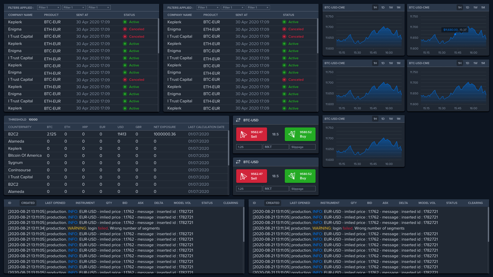
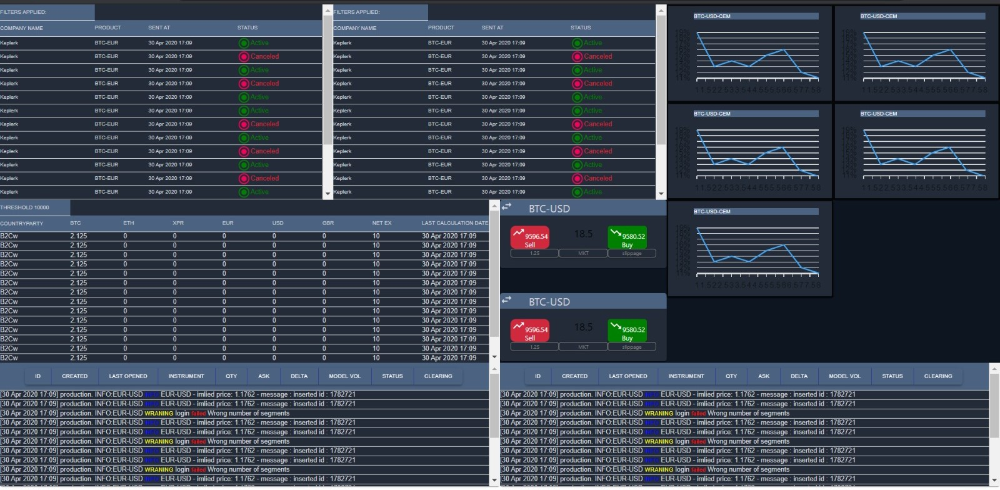

# Simulate an image
Using Material UI to develop a screen that resembles a spesific image.
 - The source:

- The result:
 


### Setup & Run

- Clone or download this repository: https://github.com/sharonNissanov/Simulate-an-image-MaterialUI
- Install dependencies: in cmd run ```npm install```
- Run the program: ```npm start```

